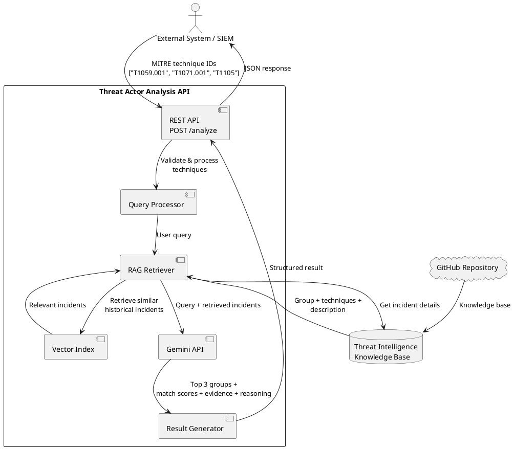
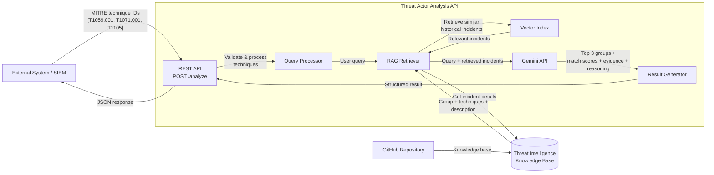

# mitre-attack-threat-group-similarity

## UMLs

### PlantUML

```plantuml
@startuml
actor "External System / SIEM" as Client

rectangle "Threat Actor Analysis API" {

    component "REST API\nPOST /analyze" as API

    component "Query Processor" as Query

    component "RAG Retriever" as RAG

    component "Vector Index" as Index

    component "Gemini API" as Gemini

    component "Result Generator" as Result
}

database "Threat Intelligence\nKnowledge Base" as DB

cloud "GitHub Repository" as GitHub


Client --> API : MITRE technique IDs\n["T1059.001", "T1071.001", "T1105"]

API --> Query : Validate & process\ntechniques

Query --> RAG : User query

RAG --> Index : Retrieve similar\nhistorical incidents

Index --> RAG : Relevant incidents

RAG --> DB : Get incident details

DB --> RAG : Group + techniques +\ndescription

RAG --> Gemini : Query + retrieved incidents

Gemini --> Result : Top 3 groups +\nmatch scores + evidence + reasoning

Result --> API : Structured result

API --> Client : JSON response

GitHub --> DB : Knowledge base
@enduml
```

---

### Mermaid UML

```mermaid
flowchart LR

    Client["External System / SIEM"]

    subgraph API_System["Threat Actor Analysis API"]
        API["REST API<br/>POST /analyze"]
        Query["Query Processor"]
        RAG["RAG Retriever"]
        Index["Vector Index"]
        Gemini["Gemini API"]
        Result["Result Generator"]
    end

    DB[("Threat Intelligence<br/>Knowledge Base")]
    GitHub["GitHub Repository"]

    Client -->|"MITRE technique IDs<br/>[T1059.001, T1071.001, T1105]"| API

    API -->|"Validate & process<br/>techniques"| Query

    Query -->|"User query"| RAG

    RAG -->|"Retrieve similar<br/>historical incidents"| Index

    Index -->|"Relevant incidents"| RAG

    RAG -->|"Get incident details"| DB

    DB -->|"Group + techniques +<br/>description"| RAG

    RAG -->|"Query + retrieved incidents"| Gemini

    Gemini -->|"Top 3 groups +<br/>match scores + evidence + reasoning"| Result

    Result -->|"Structured result"| API

    API -->|"JSON response"| Client

    GitHub -->|"Knowledge base"| DB
```
