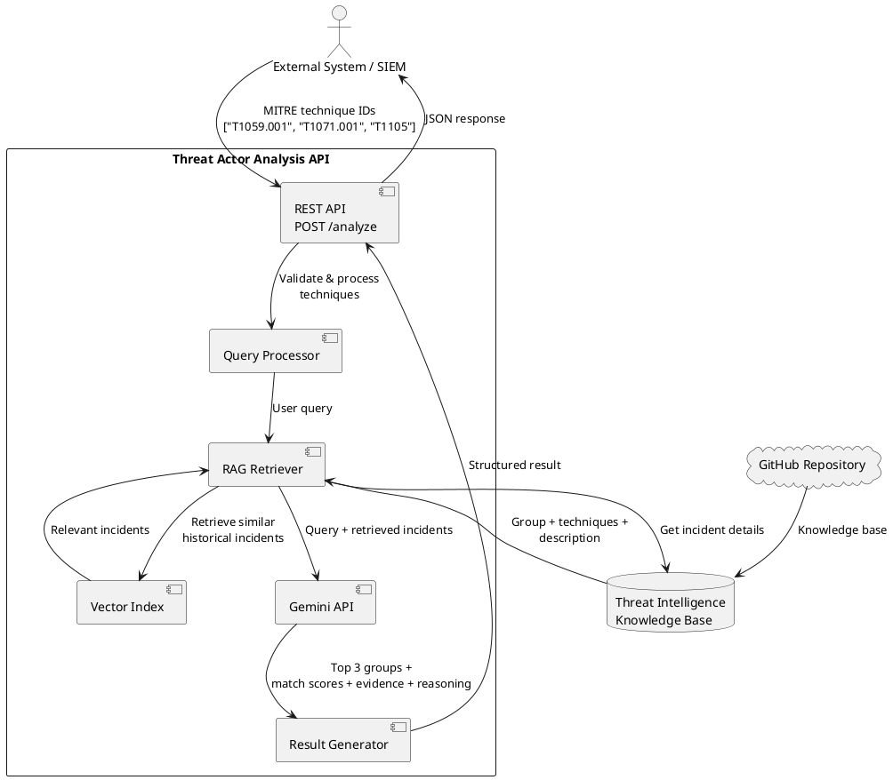
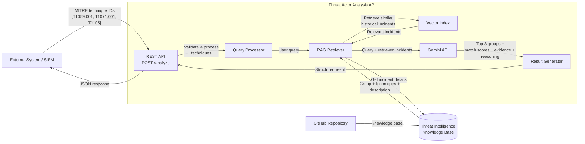
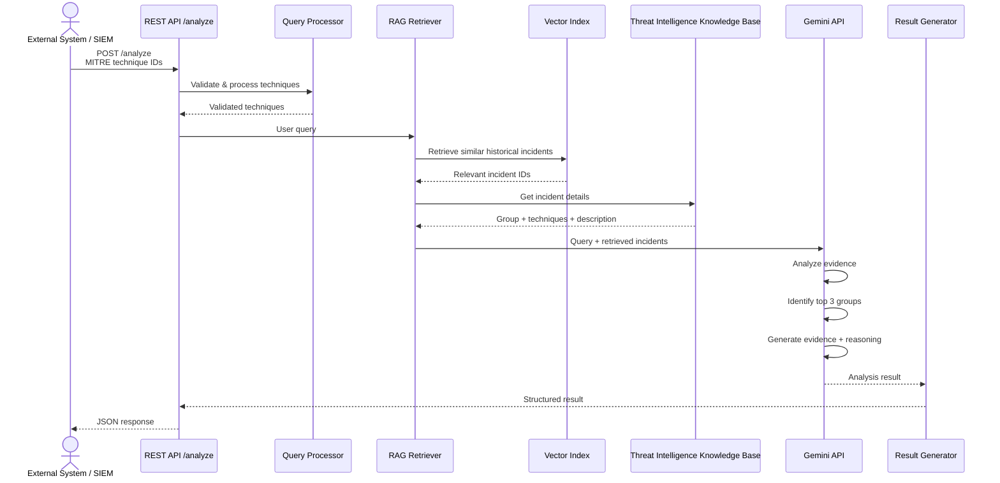

# mitre-attack-threat-group-similarity

## Data

| File | Description |
| --- | --- |
| `data/incidents_strict.json` | MITRE ATT&CK-derived incident dataset (662 incidents) |
| `data/incidents_example.json` | Small example of the same incident shape |
| `data/examples.json` | Example analysis request/response payloads |

`incidents_strict.json` matches the `incidents_example.json` shape: `incident_id`, `group`, `techniques`, `description`.

## MITRE ATT&CK® copyright

`data/incidents_strict.json` is derived from [MITRE ATT&CK®](https://attack.mitre.org/). Per MITRE's terms of use, the copyright designation ships with this data:

> © 2026 The MITRE Corporation. This work is reproduced and distributed with the permission of The MITRE Corporation.

The MITRE Corporation (MITRE) hereby grants you a non-exclusive, royalty-free license to use ATT&CK® for research, development, and commercial purposes. Any copy you make for such purposes is authorized provided that you reproduce MITRE's copyright designation and this license in any such copy.

See [MITRE ATT&CK Terms of Use](https://attack.mitre.org/resources/legal-and-branding/terms-of-use/) and the [attack-stix-data LICENSE](https://github.com/mitre-attack/attack-stix-data/blob/master/LICENSE.txt).

## UMLs

### PlantUML Component diagram




---

### Mermaid UML


### PlantUML Sequence diagram
```
@startuml
actor "External System / SIEM" as Client

participant "REST API\n/analyze" as API
participant "Query Processor" as Query
participant "RAG Retriever" as RAG
database "Vector Index" as Index
database "Threat Intelligence\nKnowledge Base" as DB
participant "Gemini API" as Gemini
participant "Result Generator" as Result

Client -> API : POST /analyze\nMITRE technique IDs
API -> Query : Validate & process techniques
Query --> API : Validated techniques

API -> RAG : User query
RAG -> Index : Retrieve similar historical incidents
Index --> RAG : Relevant incident IDs

RAG -> DB : Get incident details
DB --> RAG : Group + techniques + description

RAG -> Gemini : Query + retrieved incidents
Gemini -> Gemini : Analyze evidence
Gemini -> Gemini : Identify top 3 groups
Gemini -> Gemini : Generate evidence + reasoning
Gemini --> Result : Analysis result

Result --> API : Structured result
API --> Client : JSON response

@enduml
```


### Mermaid UML



## Colab prototype

[](https://colab.research.google.com/github/MadAcolyte/mitre-attack-threat-group-similarity/blob/main/notebooks/threat_group_similarity_gemini.ipynb)

[`notebooks/threat_group_similarity_gemini.ipynb`](notebooks/threat_group_similarity_gemini.ipynb) is an end-to-end Google Colab prototype of the architecture above. Each notebook section is one UML component: GitHub knowledge base load, Query Processor, Vector Index, RAG Retriever, Gemini API, Result Generator, and `POST /analyze`.

**How to run:** open the badge, add a Colab Secret named `GEMINI_API_KEY` (🔑 Secrets panel), then Runtime → Run all. Without a key the notebook still runs: Gemini embedding/generation cells are skipped and a TF-IDF/Jaccard fallback produces the same JSON shape as `y` in `data/examples.json`.

To refresh `data/examples.json` from **real** Gemini outputs (this will not write placeholder data), set `GEMINI_API_KEY` and run:

```bash
python scripts/regenerate_examples.py
```
